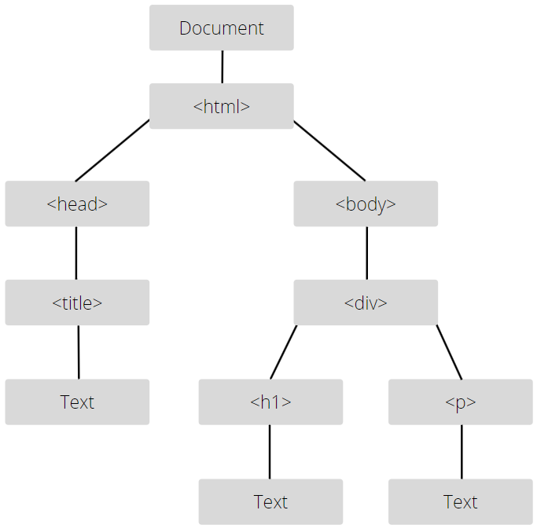

# **JavaScript DOM Manipulation**

## **Introduction**

JavaScript is the native language of web browsers. It allows web developers to create rich and dynamic web pages that provide a great user experience. Dynamic behavior in JavaScript is enabled through Document Object Model (DOM) manipulation.

## **Understanding the DOM**

HTML documents are composed of a hierarchy of elements. The DOM is the representation of HTML elements in JavaScript as a hierarchy of objects called **nodes**. Every single element in the document is represented in the DOM by a node which contains every little detail about it.

<figure>
    
    <center>
        <figcaption>
            <em>The Document Object Model Tree</em>
        </figcaption>
    </center>
</figure>

We can traverse the DOM and interact with its nodes. We can manipulate elements in our web page by interacting with their respective nodes in the DOM. We can create and insert new elements by creating new nodes and inserting them into the DOM. We can remove elements by deleting their respective nodes from the DOM.

**Examples:**

Below we will take a look at the DOM tree of an HTML document.

```HTML
<html>
    <head>
        <title>DOM Manipulation</title>
    </head>

    <body>
        <div>
            <h1>DOM Manipulation</h1>
            <p>
                We are learning JavaScript DOM manipulation
            </p>
        </div>
    </body>
</html>
```

<figure>
    
    <center>
        <figcaption>
            <em>DOM Example</em>
        </figcaption>
    </center>
</figure>

Throughout this lesson, we're going to use the following HTML markup for demonstration purposes:

```HTML
<!DOCTYPE html>
<html lang="en">
<head>
    <meta charset="UTF-8">
    <meta http-equiv="X-UA-Compatible" content="IE=edge">
    <meta name="viewport" content="width=device-width, initial-scale=1.0">
    <link rel="stylesheet" href="./main.css">
    <title>DOM Manipulation</title>
</head>
<body>
    <main class="container">
        <section class="search">
            <input type="text" placeholder="Search For Offer..."/>
            <button class="search-button">Search</button>
        </section>


        <section class="offers">
            <div class="offer special" style="background-color: rgb(255, 186, 8); padding: 20px;">
                <div class="offer-image">
                    
                </div>
                <div class="offer-details">
                    <h2>Quality Assurance Engineer</h2>
                    <small>Posted on 27/02/2022</small>
                    <button>Apply</button>
                </div>
            </div>
            <div class="offer normal">
                <div class="offer-image">
                    
                </div>
                <div class="offer-details">
                    <h2>Scrum Master</h2>
                    <small>Posted on 15/01/2022</small>
                    <button>Apply</button>
                </div>
            </div>
            <div class="offer normal">
                <div class="offer-image">
                    
                </div>
                <div class="offer-details">
                    <h2>UI / UX Designer</h2>
                    <small>Posted on 20/02/2022</small>
                    <button>Apply</button>
                </div>
                
            </div>
            <div class="offer normal">
                <div class="offer-image">
                    
                </div>
                <div class="offer-details">
                    <h2>Database Administrator</h2>
                    <small>Posted on 12/02/2022</small>
                    <button>Apply</button>
                </div>
                
            </div>
            <div class="offer normal">
                <div class="offer-image">
                    
                </div>
                <div class="offer-details">
                    <h2>Data Scientist</h2>
                    <small>Posted on 30/01/2022</small>
                    <button>Apply</button>
                </div>
                
            </div>
        </section>
    </main>

    <script src="./main.js"></script>
</body>
</html>
```

## **Querying The DOM**

In order to manipulate an element in the DOM, we first need to get hold of its node. But before we can even do that, we must learn how to access the DOM itself in JavaScript. 

The entry point to the DOM in JavaScript is the **document** object. It is a reference to the root node in the DOM tree. In order to select nodes from the DOM, we use the selector methods that the **document** object exposes:

* **.getElementById():** Returns the node of the element that has the specified id.

    ```HTML
    <section id="main-section"> <----------
        ...
    </section>
    ```

    ```JavaScript
    document.getElementById('main-section');
    ```

* **.getElementsByTagName():** Returns an **HTMLCollection** containing the nodes of all the elements of the specified tag name.

    ```HTML
    <div> <----------
        ...
    </div>

    <div> <----------
        ...
    </div>

    <div> <----------
        ...
    </div>
    ```

    ```JavaScript
    document.getElementsByTagName('div');
    ```

    _**Note:** HTMLCollection is a certain type of collection that can be accessed just like arrays using bracket notation `[]` but array methods can't be used on it._

* **.getElementsByClassName():** Returns an **HTMLCollection** containing the nodes of all the elements that have the specified class.

    ```HTML
    <p class="comment">...</p> <----------

    <p class="comment">...</p> <----------

    <p class="comment">...</p> <----------
    ```

    ```JavaScript
    document.getElementsByClassName('comment');
    ```

* **.querySelector():** Returns the node of the first element that matches the specified CSS selector.

    ```HTML
    <div>
         <----------
        
        
    </div>
    ```

    ```JavaScript
    document.querySelector('img');
    ```

    #

     ```HTML
    <section>
        <div>
            ...
            <button class="custom-button">...</button> <----------
        </div>

        <div>
            ...
            <button class="custom-button">...</button>
        </div>

        <div>
            ...
            <button class="custom-button">...</button>
        </div>
    </section>
    ```

    ```JavaScript
    document.querySelector('.custom-button');
    ```

    #

    ```HTML
    <body>
        <h1 id="main-title">...</h1> <----------

        ...
    </body>
    ```

    ```JavaScript
    document.querySelector('#main-title');
    ```

    #

    ```HTML
    <form>
        <input type="name" />
        <input type="email" />
        <input type="password" /> <----------

        ...
    </form>
    ```

    ```JavaScript
    document.querySelector('input[type="password"]');
    ```

    #

    ```HTML
    <section id="main-section">
        <p>
            ...
            <span>...</span>  <----------
            ...
            <span>...</span>
            ...
            <span>...</span>
        </p>
    </section>
    ```

    ```JavaScript
    document.querySelector('#main-section p span:first-child');
    ```

* **.querySelectorAll():** Returns a **NodeList** containing the nodes of all elements that match the specified CSS selector.

    ```HTML
    <div>
         <----------
         <----------
         <----------
    </div>
    ```

    ```JavaScript
    document.querySelectorAll('img');
    ```

    #

     ```HTML
    <section>
        <div>
            ...
            <button class="custom-button">...</button> <----------
        </div>

        <div>
            ...
            <button class="custom-button">...</button> <----------
        </div>

        <div>
            ...
            <button class="custom-button">...</button> <----------
        </div>
    </section>
    ```

    ```JavaScript
    document.querySelectorAll('.custom-button');
    ```

    
    _**Note:** NodeList is a certain type of collection that can be accessed just like arrays using bracket notation `[]` but array methods can't be used on it, except for `.forEach()`._

Selectors return a node object containing every little detail about the selected element. We use the node object's properties and methods to query the state of the element and to manipulate it as well. The returned node objects differ depending on the type of the selected element.

To learn more about node objects, let's select the first offer in the offers section and log the result to the console:

```JavaScript
const offer = document.querySelector('.offers > .offer:first-child');

console.dir(offer);
```

_**Note:** The `.dir()` method of the `console` object displays a JavaScript object as a hierarchical listing on the console._

The offer element is a `<div>` element. Below are some of the properties that are present in its node:

* **innerHTML:** Represents the HTML content inside the element.

    ```JavaScript
    console.log(offer.innerHTML);

    /*
        <div class="offer-image">
            
        </div>
        <div class="offer-details">
            <h2>Quality Assurance Engineer</h2>
            <small>Posted on 27/02/2022</small>
            <button>Apply</button>
        </div>
    */

    /* Let's change the HTML content */
    offer.innerHTML = '<h1>Hello From JavaScript!</h1>';
    ```

* **textContent:** Represents the text content inside the element.

    ```JavaScript
    console.log(offer.textContent);

    /*
        Quality Assurance Engineer
        Posted on 27/02/2022
        Apply
    */

    /* Let's change the text content */
    offer.textContent = 'JavaScript is so versatile!';
    ```

    _**Note:** Unlike innerHTML, textContent does not interpret HTML. For example, setting textContent to `<h1>Hello World!</h1>` will display "`<h1>Hello World!</h1>`" literally on the page._

* **className**: Represents the element's class names in a string.

    ```JavaScript
    console.log(offer.className);

    /*
        offer special
    */

    /* We can set class names by passing them as a string */
    offer.className = "offer special large";
    ```

* **classList**: Represents the element's class names in a **DOMTokenList**.

    ```JavaScript
    console.log(offer.classList);

    /*
        DOMTokenList(3) ['offer', 'special', value: 'offer special']
    */

    /* We can add classes using the .add() method */
    offer.classList.add('large');

    /* We can remove classes using the .remove() method */
    offer.classList.remove('large');

    /* We can toggle classes using the .toggle() method */
    /* If they exist, they will be removed. If they don't exist, they will be added.*/
    offer.classList.toggle('large');
    offer.classList.toggle('special');
    ```

    _**Note:** DOMTokenList is a certain type of collection that can be accessed just like arrays using bracket notation `[]` but array methods can't be used on it. It has some special methods of its own like **.add()**, **.remove()**, and **.toggle()**._

* **style**: Represents the element's inline styling properties in an object. (Inline styling properties are the ones defined in the `style` attribute)

    ```JavaScript
    console.log(offer.style.padding);
    console.log(offer.style.backgroundColor);

    /*
        20px
        rgb(255, 186, 8)
    */

    /* Let's change the inline styling */
    offer.style.padding = '50px';
    offer.style.backgroundColor = 'red';
    ```

Now let's select more items of different types, specifically `<input>` and ``:

```JavaScript
const searchInput = document.querySelector('.search > input[type="text"]');

console.dir(searchInput);


const offerImage = offer.querySelector('.offer-image > img');

console.dir(offerImage);
```

_**Note:** Selector methods are not exclusive to the **document** object, they can be used on a node as well to select one of its descendant nodes. In this case, we use a selector method on the offer element to select its descendant `` element._

Now let's check some of the properties that are present in their nodes:

* **placeholder:** Represents the placeholder of the input.

    ```JavaScript
    console.log(searchInput.placeholder);

    /*
        Search For Offer...
    */

    /* Let's change the input placeholder */
    searchInput.placeholder = "What Offer Are You Looking For ?";
    ```

* **value:** Represents the value of the input.

    ```JavaScript
    console.log(searchInput.value);

    /*
        
    */

    /* Let's change the input value */
    searchInput.value = "Software Engineer";
    ```

* **type:** Represents the type of the input.

    ```JavaScript
    console.log(searchInput.type);

    /*
        text
    */

    /* Let's change the input type */
    searchInput.type = "password";
    ```

    #

* **src:** Represents the source path of the image.

    ```JavaScript
    console.log(offerImage.src);

    /*
        file:///C:/Users/Iheb/Desktop/JavaScript%20DOM/assets/quality-assurance.png
    */

    /* Let's change the image to a bird image! */
    offerImage.src = "https://ichef.bbci.co.uk/news/976/cpsprodpb/67CF/production/_108857562_mediaitem108857561.jpg";
    ```

* **alt:** Represents the alternative text of the image.

    ```JavaScript
    console.log(offerImage.alt);

    /*
        Quality Assurance Logo
    */

    /* Let's change the image alternative text */
    offerImage.alt = "Bird Image";
    ```

## **Traversing the DOM**
Nodes returned by DOM selectors allow us to manipulate elements on our page. They also allow us to traverse the DOM using a handful of properties. We can get the nodes of an element's parent, its siblings, and its children as well.

We'll be using the same `offer` node to demonstrate DOM traversal.

* **parentElement:** Returns the node of the element's parent element.

    ```JavaScript
    const parentElement = offer.parentElement;

    console.log(parentElement);

    // --> <div class="offers">...</div>
    ```

* **children:** Returns the nodes of the element's child elements in an HTMLCollection.

    ```JavaScript
    const children = offer.children;
    
    console.log(children);

    // --> HTMLCollection(3) [h2, small, button]
    ```

* **nextElementSibling:** Returns the node of the element's next sibling (the sibling that comes after it).

    ```JavaScript
    const nextSibling = offer.nextElementSibling;
    
    console.log(nextSibling);

    // --> <div class="offer">...</div>
    ```

* **previousElementSibling:** Returns the node of the element's previous sibling (the sibling that comes before it).

    ```JavaScript
    const previousSibling = offer.previousElementSibling;
    
    console.log(previousSibling);

    // --> null (because offer is the first sibling)
    ```

## **Adding Elements To The DOM**

In addition to manipulating elements on the page, JavaScript allows us to programmatically create and add elements to the page. 

The premise is very simple, we will create nodes for each element we want to add to the page, link the nodes in a hierarchical manner if needed, and then add them to the DOM.

Let's add a fourth offer to the offers section of our page using JavaScript. The offer's markup should be as follows:

```HTML
<div class="offer ">
    <div class="offer-image">
        
    </div>
    <div class="offer-details">
        <h2>Fullstack Developer</h2>
        <small>Posted on 18/01/2022</small>
        <button>Apply</button>
    </div>
</div>
```

First of all, we will create a node for each element using the **createElement()** method of the **document** object:

```JavaScript
const newOffer = document.createElement('div');

const newOfferImage = document.createElement('div');
const image = document.createElement('img');

const newOfferDetails = document.createElement('div');
const title = document.createElement('h2');
const date = document.createElement('small');
const button = document.createElement('button');
```

Now, let's set the attributes on our elements using the **.setAttribute()** method:

```JavaScript
newOffer.setAttribute('class', 'offer');

newOfferImage.setAttribute('class', 'offer-image');
image.setAttribute('src', './assets/developer.png');
image.setAttribute('alt', 'Developer Logo');

newOfferDetails.setAttribute('class', 'offer-details');
```

_**Note:** We could have modified the properties of the nodes directly. But that way, the values won't be reflected as attributes in HTML. Keep in mind that attributes and properties of an element may seem identical, but they are different. For instance, we can set a custom attribute named `my-custom-attribute` and it will show up in HTML, but there won't be a property named `myCustomAttribute` on the node._

_**Note:** Similar to setting an attribute on a node, we can get the value of an attribute using **.getAttribute()**._

We will also need to create nodes for the text inside each element:

```JavaScript
const titleText = document.createTextNode('Fullstack Developer');
const dateText = document.createTextNode('Posted on 18/01/2022');
const buttonText = document.createTextNode('Apply');
```

_**Note:** An alternative to the preceding is to use the `textContent` property of our elements to add text._

Now let's link the text nodes to their respective elements using the **appendChild()** method:

```JavaScript
title.appendChild(titleText);
date.appendChild(dateText);
button.appendChild(buttonText);
```

Now let's link our elements in a hierarchical manner. `title`, `date` and `button` should be children of `offerDetails`, `image` should be a child of `offerImage`, and `offerDetails` and `offerImage` should be children of `offer`.

We can add children to a node using the **appendChild()** method. Note that children should be added in the correct order:

```JavaScript
newOfferDetails.appendChild(title);
newOfferDetails.appendChild(date);
newOfferDetails.appendChild(button);

newOfferImage.appendChild(image);

newOffer.appendChild(newOfferImage);
newOffer.appendChild(newOfferDetails);
```

Now that we've finished creating our new element, we need to add it to the DOM. To do that, we simply need to append it as a child to one of the existing nodes in the DOM. 

In this case, we will query the DOM for the `<div>` element that contains all offers and add our element to it:

```JavaScript
const offers = document.querySelector('.offers');

offers.appendChild(newOffer);
```

If we check our page now, we'll find the newly added offer.

## **Removing Elements From The DOM**

In addition to programmatically creating and adding elements to the DOM, JavaScript allows us to programmatically remove elements from the DOM.

The premise is very simple, we first select the element we want to remove, we get its parent element, and then we remove it from the parent's children.

Let's remove the first offer in our offers section.

First, we will select the offer element:

```JavaScript
const offerToRemove = document.querySelector('.offers > .offer:first-child');
```

Now, we will get a reference to its parent element:

```JavaScript
const parent = offerToRemove.parentElement;
```

Finally, we will remove the offer from the parent's children using the **removeChild()** method:

```JavaScript
parent.removeChild(offerToRemove);
```

That's it! If we check our page now, we'll see that the first offer has been deleted.


## **Conclusion**

Dynamic content is enabled in JavaScript through DOM manipulation. In fact, we can create entire web pages, including markup and styling, using JavaScript alone. 

There's still one missing piece of the dynamic behavior puzzle, and that's responding to user behavior. The creation of interactive web pages is enabled in JavaScript through events, which is the topic for our next lesson.